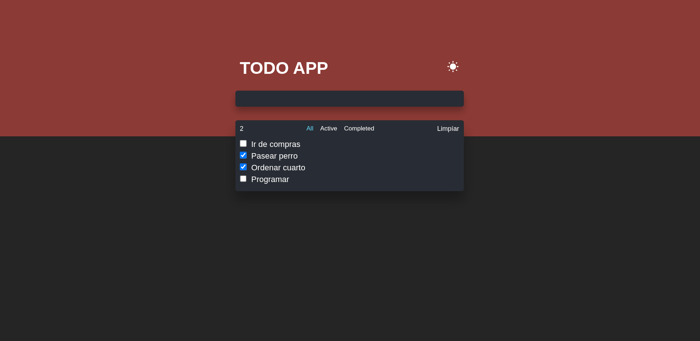
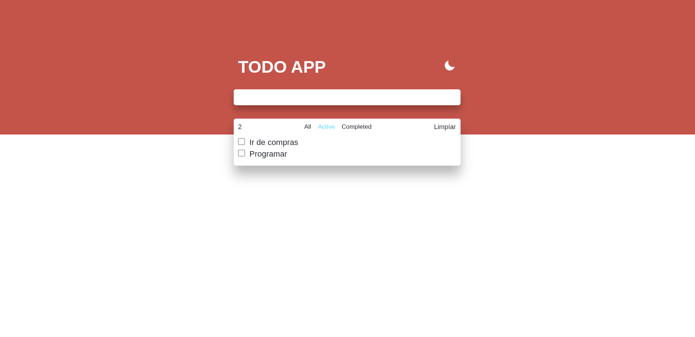

# Todo App - React

Una aplicación de gestión de tareas (To-Do List) moderna, minimalista y funcional, diseñada para ofrecer una experiencia de usuario limpia y adaptativa.

Captura de pantalla de la App





## Características

*   **Gestión de Tareas:** Añade, marca como completadas y elimina tareas fácilmente.
*   **Modo Oscuro/Claro:** Interfaz adaptativa con un conmutador de tema visualmente atractivo.
*   **Filtros Inteligentes:** Visualiza tus tareas por estado: *Todas*, *Activas* o *Completadas*.
*   **Limpieza Rápida:** Opción para eliminar todas las tareas completadas de un solo clic.

## Tecnologías Utilizadas

*   **React.js** - Biblioteca principal para la interfaz de usuario.
*   **CSS3** - Estilos personalizados con un enfoque en diseño moderno (incluyendo Flexbox/Grid).
*   **JavaScript (ES6+)** - Lógica de la aplicación y manejo de estado.

## Instalación y Configuración

Sigue estos pasos para ejecutar el proyecto localmente:

1.  **Clona el repositorio:**
    ```bash
    git clone [https://github.com/contreras48/todo_app_react.git)
    ```
2.  **Navega al directorio del proyecto:**
    ```bash
    cd todo_app_react
    ```
3.  **Instala las dependencias:**
    ```bash
    npm install
    ```
4.  **Inicia la aplicación en modo desarrollo:**
    ```bash
    npm start
    ```
